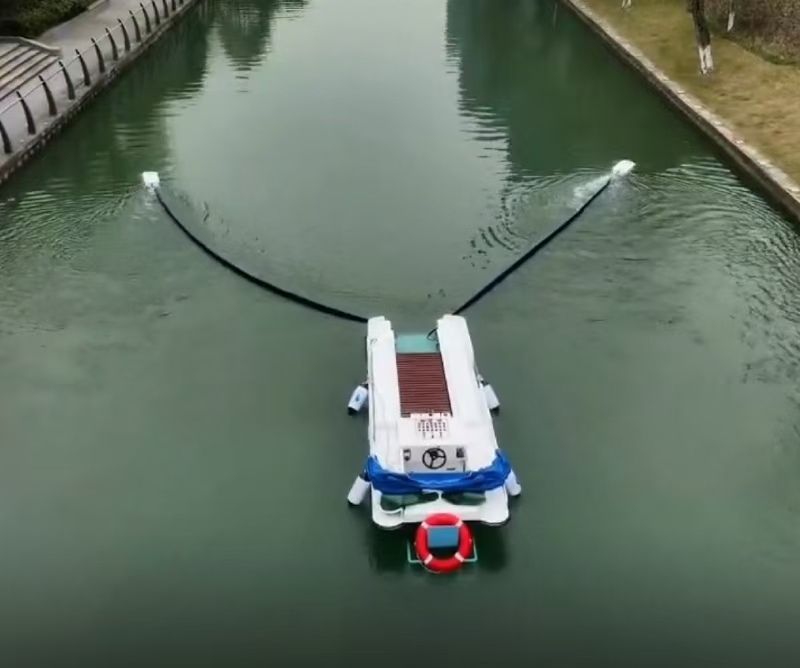
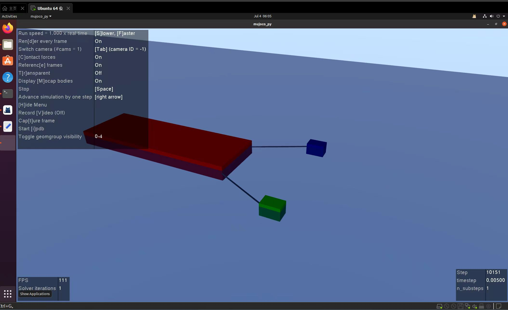
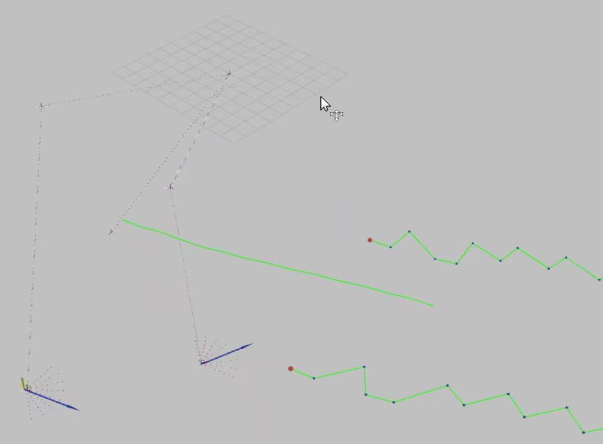
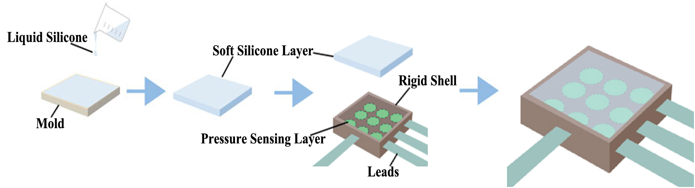
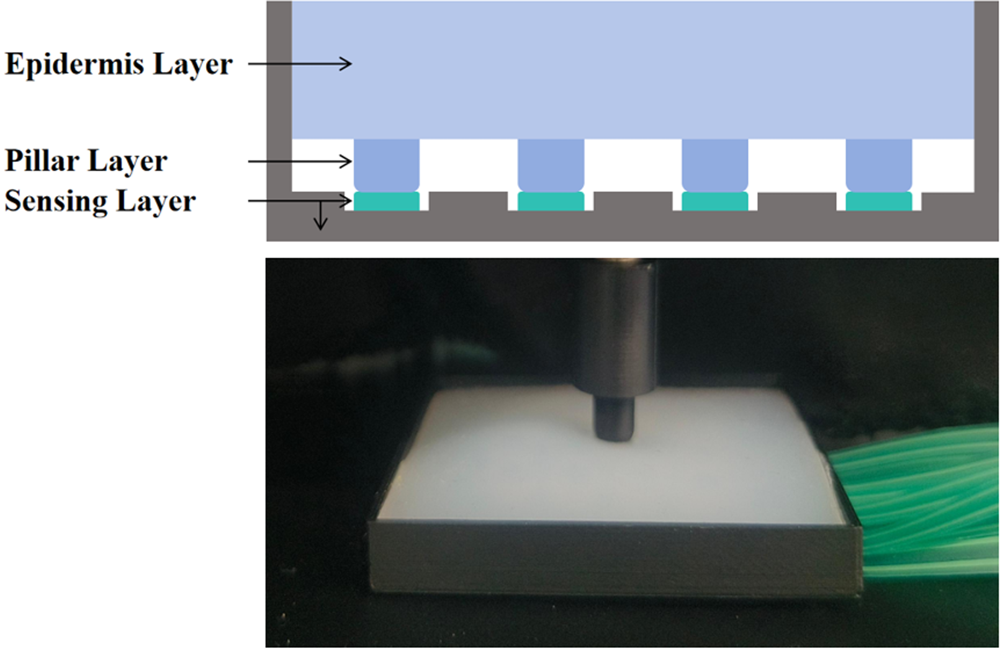

---

## **2023.09 - 2023.10 | China Agricultural Robot Competition: Strawberry-picking Robot**

This is the first time during my undergraduate studies that I have stepped into a robot laboratory and come into direct contact with robots. During this experience, I learned to use simple tools related to robots, such as Arduino and OpenMV. At the same time, I also gained a preliminary understanding of various skills of robots, including the identification of fasteners such as screws, nuts, and studs, as well as the use of tools like welding torches, handsaws, and bench drills. In this competition, I achieved the autonomous line patrol of the crawler robot, but due to my lack of experience, I failed to complete the identification and picking of strawberries.

---

## **2024.03 - 2024.07 | ASABE Student Robotics Competition: Sick Leaf Pruning Robot**

<em> (At that time, no photos were saved. Only one photo of the robot left before departure was found.) </em>

During the summer vacation of my freshman year, I was honored to go to Anaheim, USA to participate in the ASABE International College Students' Robot Design Competition and achieved the excellent result of ranking 4th internationally. During the competition, we successfully designed a robot that operates in parallel with two arms for the identification and pruning of diseased leaves. During this experience, I learned the use of the yolo algorithm, the configuration and basic operations of the ubuntu system, the relevant basic knowledge of Jetson Orin Nano, ros and OpenCV, SolidWorks, 3D printing, the drawing and processing of PCB boards, and other more advanced robot-related technologies.

---

## **2024.10 - 2024.12 | Intelligent Robot Agile Hand Competition: Agile Hand Grasp and Place**

  

    
     
    <em>Team photo</em>
  

  

    
     
    <em>Competition poster</em>
  

  

    
     
    <em>Group photo at the final site</em>
  

  

    
     
    <em>Photos of the event venue</em>
  

In this competition, we achieved the coordination of arms to complete the tasks of disordered sorting, workpiece assembly, labeling and scanning. During this experience, I initially gained an understanding of the knowledge related to somatic intelligence, learned the basic process of arm coordination, and completed the entire process including calibration, feature extraction, matching, and recognition based on binocular vision and yolo. In the final round, apart from the company team, among the university teams, we only narrowly lost to the Youth Winning Team from Tsinghua University and achieved the third prize (second among universities).

  

    <em>(The video of the final round was not saved at that time. Here is a demo from the preliminary round.)</em>
    <video width="640" height="480" controls>
        <source src="../images/ihander/2.mp4" type="video/mp4">
        Your browser does not support the video tag.
    </video>
  

---

## **2025.04 - Present | Autonomous Control System For Multi-ship Coordination**

  

    
     
  

  

    
     
  

  

    
     
  

In this project, we need to design a system where two small towing boats (powered) pull a large boat (unpowered) behind to complete self-cleaning on the water surface. At present, our team has completed the detection and tracking of the target, the simulation of the control of the towed vessel based on PID, the positioning of the large and small boats, and the path planning based on A*. However, due to the overly complex water surface conditions, we decided to change the plan and install a lidar above the small towing vessel to achieve more accurate mapping and positioning.

<em> (At present, the company we are in contact with is installing the corresponding hardware. Once the hardware installation is completed, we will proceed with the next step of scheme verification and physical debugging.) </em>

---

## **2025.07 - Present | Robot Tactile Sensor**

### A Low-Cost Super-Resolution Tactile Sensor

  

    
  

Inspired by the mechanism of human skin embedding receptors in soft tissues, our group designed a low-cost tactile sensor that achieves super-resolution sensing through optimizing the soft silicone layer rather than increasing sensor density. By systematically testing different thickness and hardness combinations, we selected the optimal parameters: 6mm thickness with Shore hardness 5.
With only 9 pressure sensing units in a sparse array, the sensor achieves millimeter-level localization accuracy over a 22.8 × 22.8 mm area. The force estimation error is 0.61 N on average. Notably, the sensor is only 6 mm thick, much more compact than vision-based tactile sensors (15 mm). The soft layer enables force propagation across multiple sensors, and we developed a reconstruction algorithm based on bivariate Gaussian distribution to estimate contact location and magnitude.

### Pillar-Structure Enhancement

  

    
  

To further enhance sensitivity and consistency, I incorporated a bio-inspired pillar structure mimicking the stratum spinosum of human skin. The design features cylindrical pillars (5mm diameter, 2mm height) beneath a 4mm epidermis layer.

Comparative experiments showed that the pillar structure reduces force localization error by over 30%. The pillars effectively concentrate mechanical stress and transmit it to the pressure sensors, resulting in higher sensitivity and better consistency. This improvement was also validated in robotic grasping experiments, where the enhanced sensor enabled more reliable object manipulation and damage prevention.

### Present Stage
With the arrival of the new equipment "flexible electronic printer" in the laboratory, I will explore how to design more complex and efficient circuits and structures so that the new tactile sensor can accurately detect horizontal, vertical and rotational forces and moments, and respond more quickly with higher resolution. Ultimately, this tactile sensor was designed as a complete "electronic skin" and embedded in the robot's hands and arms to achieve an integrated system of "tactile - hand - arm".
