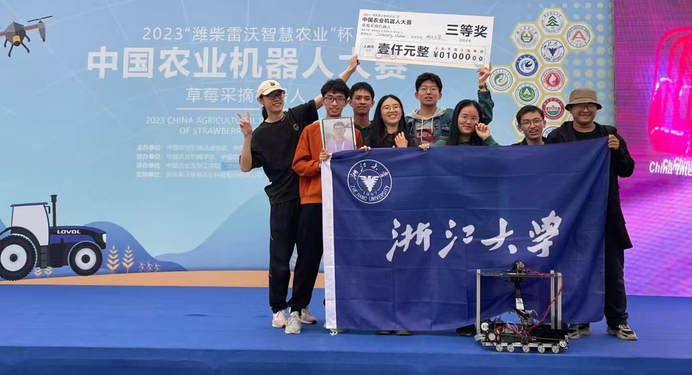

---

## **2023.09 - 2023.10 | China Agricultural Robot Competition: Strawberry-picking Robot**

This is the first time during my undergraduate studies that I have stepped into a robot laboratory and come into direct contact with robots. During this experience, I learned to use simple tools related to robots, such as Arduino and OpenMV. At the same time, I also gained a preliminary understanding of various skills of robots, including the identification of fasteners such as screws, nuts, and studs, as well as the use of tools like welding torches, handsaws, and bench drills. In this competition, I achieved the autonomous line patrol of the crawler robot, but due to my lack of experience, I failed to complete the identification and picking of strawberries.

---

## **2024.03 - 2024.07 | ASABE Student Robotics Competition: Sick Leaf Pruning Robot**

 
<em> (At that time, no photos were saved. Only one photo of the robot left before departure was found.) </em>

During the summer vacation of my freshman year, I was honored to go to Anaheim, USA to participate in the ASABE International College Students' Robot Design Competition and achieved the excellent result of ranking 4th internationally. During the competition, we successfully designed a robot that operates in parallel with two arms for the identification and pruning of diseased leaves. During this experience, I learned the use of the yolo algorithm, the configuration and basic operations of the ubuntu system, the relevant basic knowledge of ros and OpenCV, SolidWorks, 3D printing, the drawing and processing of PCB boards, and other more advanced robot-related technologies.

---

## **2024.10 - 2024.12 | Intelligent Robot Agile Hand Competition: Agile Hand Grasp and Place**

---

## **2025.04 - Present | Autonomous Control System For Multi-ship Coordination**

---

## **2025.07 - Present | Robot Tactile Sensor**

### A Low-Cost Super-Resolution Tactile Sensor

### 111

### 222
